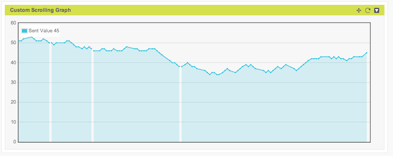

# Summary

This reference Javascript implements a scrolling widget that refreshes itself and makes calls to Exosite using the widget 'read' api to look for new data.  Developers can modify to fit their needs with all of the options available to them in the code.  This code assumes that the widget container is not set to refresh on it's own.

### To use:

1. Add a new Widget on a custom dashboard (Add Widget button)
2. Choose Custom Widget type.
3. Copy the code from the .js file and insert into the widget configuration window
4. Set refresh time to 0, pick 1 data source to display, and the x/y size for the widget
5. Save and reload the page.

#### Notes: 
1. IMPORTANT: This only supports one data source to be used.
2. WARNING: This is reference code, there are no guarantees.  It's easy to chagne the code and have it break.  Tip: Use source control when editing!
3. WARNING: Using code that refreshes often in browser windows carefully.  You can easily kill your browser.

### Examples of what it looks like

