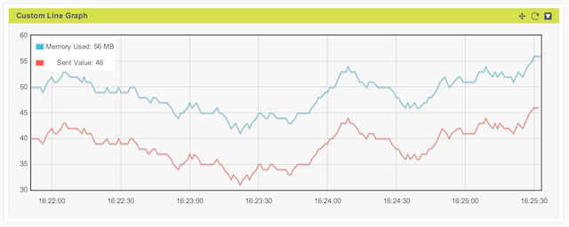

# Summary

This reference Javascript duplicates the off the shelf Line Graph widget as a custom widget, making a call to the Flot graphing library. Developers can modify to fit their needs with all of the options available to them in the code.  This code assumes that the data and dataport information will be provided on each widget container refresh.

### To use:

1. Add a new Widget on a custom dashboard (Add Widget button)
2. Choose Custom Widget type.
3. Copy the code from the .js file and insert into the widget configuration window
4. Choose refresh time, data to display, and x/y size for the widget
5. Save and reload the page.

### What it looks like

