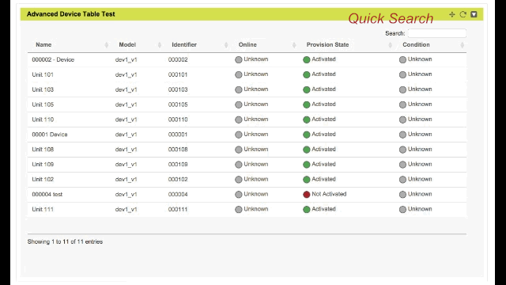

# Summary

This reference Javascript provides an example of creating a Device Table using a JQuery plugin called dataTable ([http://www.datatables.net/](http://www.datatables.net/)).  This is meant to be used inside of a custom widget (or domain widget) and allows developers to customize for their application needs. This table has great support for search and sorting.

Developers can modify the use of the dataTable plugin and CSS in addition to adding other code to provide other functionality, like online status, error codes, links to other dashboard pages.  

This widget uses the Portals API to get a list of devices in a portal and to get information about all of the devices.

The widget has a JSON object that contains a client model id to domain dashboard id for supporting clicking on a device row and going to a domain dashboard for that specific device.

### To use:

1. Add a new Widget on a custom dashboard (Add Widget button)
2. Choose Custom Widget type.
3. Copy the code from the .js file and insert into the widget configuration window
4. Set the refresh time to 0 seconds, set the x/y size for the widget to 4 width, 3 height.  You can choose different sizes but you will need to modify the code to make it fit properly.  
5. Save and reload the page.

### What it looks like

### Notes / Things you can do
1. The Bulk Get Devices call in the Portals API is limited to 11 devices in the portal currently, this is being fixed.
2. Although shown, does not include support for calculating if a device is online.  This could be done by making calls to device dataports to see last value timestamps or by reading a dataport that a Lua script keeps updated.
3. You can choose to add values from dataports as columns, this would likely require subsequent asynchronous AJAX cals to the Portals API to get those values.  (E.g. for a 'Condition' or 'Online' column)
4. Change the dataTable options to use pages instead of scrolling.
5. Change other dataTable options and CSS for look and functionality.